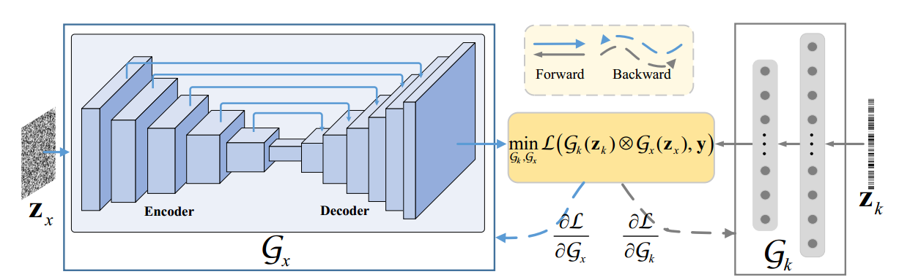
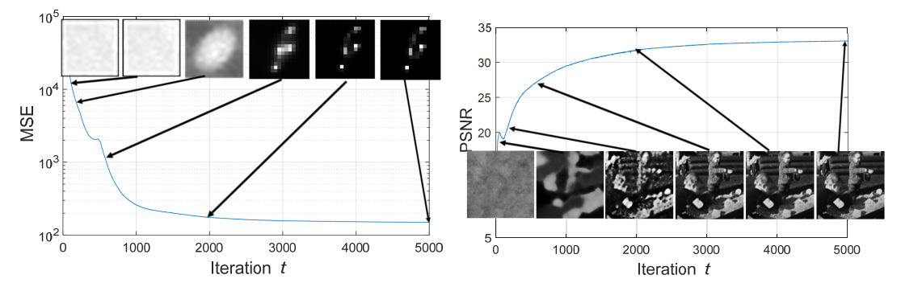
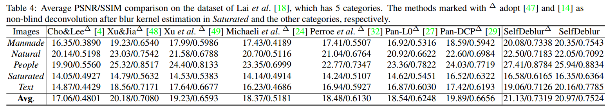
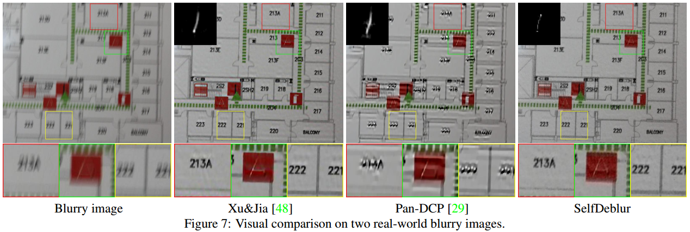
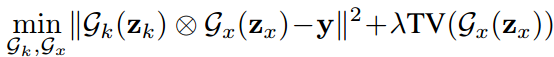
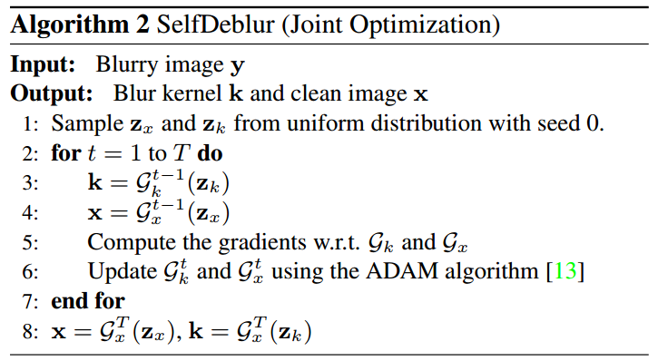

# Neural Blind Deconvolution Using Deep Priors

## what they do

为图像和PSF设计两个神经网络。利用神经网络可以过拟合的特性，将神经网络的训练看作是目标函数的优化。属于单图盲空不变去模糊。



## why

motivation from DIP（Deep image prior）

## Performance





其他实验：

- joint-training优于alternating-training 

- PSF对应的全连接好于convolution network

- 这个方法中PSF的准确程度高于图像的准确程度，用估计得到的PSF进行非盲复原效果更好（0.1-0.3db提升）
  
  

## Details

用神经网络构建出的目标函数


求解步骤：（竟然没有TV项的步骤）



Settings for experiments:

- 5000 epoch，decrease factor 0.5 @ [2000,3000,4000]

- resmaple Zx at each iteration

- nosie level estimation: scale invariance and noise in natural images

- lambda keep fixed for experiments to 1e-6

- non-blind deconvolution for levin dataset: Efficient marginal likelihood optimization in blind deconvolution

- non-blind deconvolution for lai dataset: Fast image deconvolution using
  hyper-Laplacian priors

## 实测体验

**实际损失函数并没有仅仅使用MSE，还用了SSIM！（可以增加复原图像细节）**

```python
  # training loss Setting
  if step < 1000:
      total_loss = mse(out_y,y) 
  else:
      total_loss = 1-ssim(out_y, y)
 # part of ssim loss
 def _ssim(img1, img2, window, window_size, channel, size_average=True):
    mu1 = F.conv2d(img1, window, padding=window_size // 2, groups=channel)
    mu2 = F.conv2d(img2, window, padding=window_size // 2, groups=channel)

    mu1_sq = mu1.pow(2)
    mu2_sq = mu2.pow(2)
    mu1_mu2 = mu1 * mu2

    sigma1_sq = F.conv2d(img1 * img1, window, padding=window_size // 2, groups=channel) - mu1_sq
    sigma2_sq = F.conv2d(img2 * img2, window, padding=window_size // 2, groups=channel) - mu2_sq
    sigma12 = F.conv2d(img1 * img2, window, padding=window_size // 2, groups=channel) - mu1_mu2

    C1 = 0.01 ** 2
    C2 = 0.03 ** 2

    ssim_map = ((2 * mu1_mu2 + C1) * (2 * sigma12 + C2)) / ((mu1_sq + mu2_sq + C1) * (sigma1_sq + sigma2_sq + C2))

    if size_average:
        return ssim_map.mean()
    else:
        return ssim_map.mean(1).mean(1).mean(1)
```

**用刃边图测复原效果可以，但PSF不对（可能是刃边图太单调的原因）。高斯模糊效果不好。**

**在levin上会有额外的噪声**

**复原结果每次都会有随机的位置偏置！！！！！！**

## Questions

None

## Comments

- 不能处理噪声
- 随机的输入保证了不会将出现（模糊图+I）的解，但也无法保证解的稳定性。
